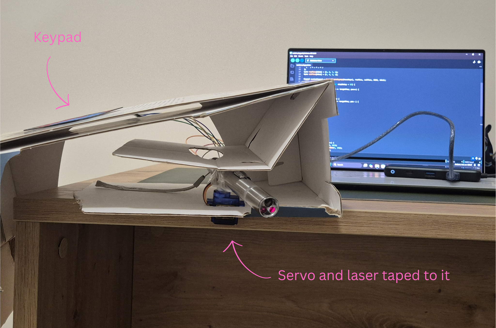
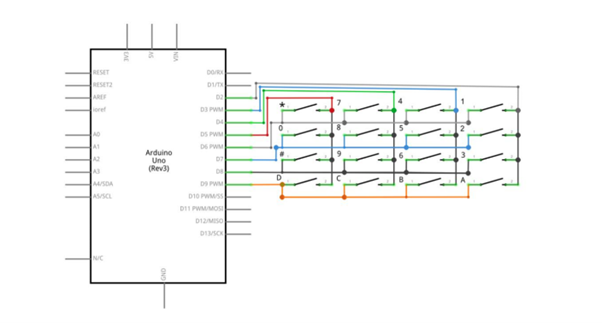
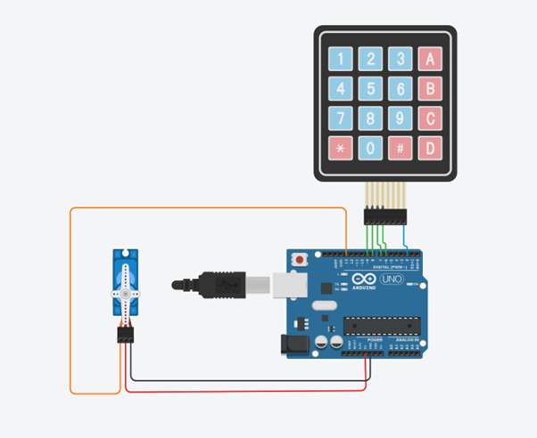

# Project 2: Cat Toy 🐱🔦

I bought a laser toy for my cats to keep them entertained, but it broke. Instead of buying a new one, I figured I’d try making one myself using stuff I already had. It turned out to be fun and my cats loved it

## Components Used
- 1 × Keypad (4x4 matrix)  
- 1 × Servo motor  
- A laser or any cat toy that makes sense here  
- Some tape  
- A shoebox  
- Arduino Uno  

## Steps to Build
1. Measure the size of the servo and cut a hole in the bottom of the shoebox so it can sit securely.  
2. Cut openings in the front and sides of the box so the laser light can pass through and the wires can be routed cleanly.  
3. Mount the servo inside the box and tape the laser securely to the servo horn.  
4. Connect the servo to GND, VCC, and a digital PWM pin on the Arduino.  
5. Connect the keypad to the Arduino using standard digital pins.  

I didn't have a shoebox, so I used an opened carton for a frying pan but a shoebox or any kind of mounting system would work much better.

## How the Keypad Works
The keypad is basically a grid of buttons arranged in rows and columns:  

Each button sits at the intersection of a row and a column. When you press a button, it connects that row and column, and the Arduino detects it by scanning the matrix.  

- Rows are set as outputs, and columns are inputs.  
- The Arduino scans one row at a time by setting it **LOW** and checking which column reads **LOW** — that’s how it knows which button was pressed.  

Here’s the wiring diagram for the keypad:  

### Standard 4x4 Keypad Wiring
- Pin 1 → D9  
- Pin 2 → D8  
- Pin 3 → D7  
- Pin 4 → D6  
- Pin 5 → D5  
- Pin 6 → D4  
- Pin 7 → D3  
- Pin 8 → D2  

## Circuit Schematic
Here’s the overall setup I designed in Tinkercad:  

## How the Code Works

### moveServo(targetPos, stepDelay)
This function is what makes the servo move smoothly instead of jumping from one angle to another.  

When you call it, it compares the current position (`startPos`) to the target angle (`targetPos`) and figures out whether it needs to increment or decrement. It then loops through each intermediate angle, writing it to the servo and waiting `stepDelay` milliseconds between steps.  

Smaller delays make the motion faster, while larger ones slow it down but make it more fluid. The loop uses a local variable `pos` to iterate through the angles, and once the movement is complete, it updates `startPos` so the next move starts from the correct position.  

Any other function that wants the servo to move just calls `moveServo()` with the desired angle and optional delay — so that way, all motion stays consistent and smooth.  

This was something I figured out after a lot of trial and error. Directly jumping from one angle to another is rigid and rough, doesn’t look nice, and isn't as smooth for my cats to follow. I wanted it to be smoother, so after some research I found that breaking the movement into small steps by gradually adjusting the angle with short delays makes the servo transitions smooth and realistic.  

### swingLeft()
This moves the servo to the far left (0°).  

It calls `moveServo(0)` without specifying a delay, so it uses the default (usually 15 ms per step). Since `moveServo` uses `startPos` to figure out where the servo currently is, it always transitions smoothly, no matter what angle it started from.  

Once the move is done, `startPos` is updated to 0°, ready for the next command.  

### swingRight()
Same idea as `swingLeft()`, but it moves the servo to the far right (180°).  

It calls `moveServo(180)` and lets the default delay handle the speed. Internally, `moveServo` checks whether it needs to increment or decrement based on `startPos`, and then steps through the angles accordingly.  

After the move, `startPos` becomes 180°, so future movements stay accurate.  

### reset()
This brings the servo back to the center (90°).  

It prints a message to the Serial Monitor and then calls `moveServo(90)`. Like the other movement functions, it uses the same smooth stepping logic, so even if the servo was at an extreme angle, it transitions back to center gradually.  

Once it’s done, `startPos` is updated to 90°.  

### autoPlay()
This one’s a bit more dynamic.  

It loops a fixed number of times (15), and in each iteration, it picks a random angle between 0° and 180°, plus a random delay between 5 and 20 ms. It then calls `moveServo()` with those values, making the servo move unpredictably.  

After each move, it pauses for a random amount of time (between 500 and 1500 ms) to simulate natural breaks. Once all 15 moves are done, it calls `reset()` to bring the servo back to center.  

Each move starts from the current `startPos`, so the transitions stay smooth.  

### setup()
This runs once when the Arduino powers on.  

It starts Serial communication for debugging, attaches the servo to its designated pin, and moves it to the starting position (`startPos`, usually 90°). There’s a short delay to give the servo time to physically reach that position.  

This setup ensures the servo starts in a known state before the main loop begins.  

### loop()
This is the heart of the program.  

It constantly checks the keypad using `getKey()` to see if a button is pressed. If a key is detected, it prints it to the Serial Monitor and uses a switch statement to decide what to do:  

- **A →** swingLeft()  
- **B →** swingRight()  
- **C →** autoPlay()  
- **D →** reset()  
- Any other key → prints a warning message  

Since all movement goes through `moveServo()`, the transitions stay smooth and `startPos` is always kept up to date.  
