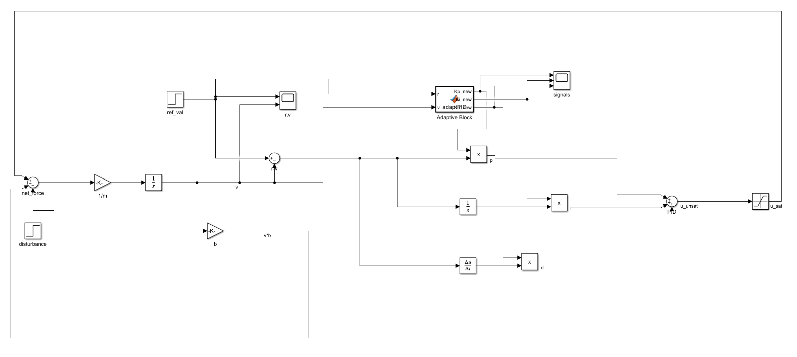
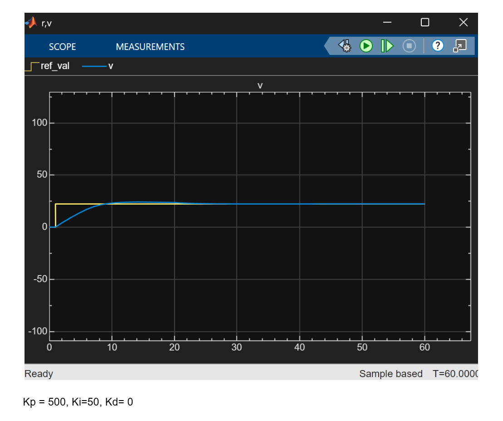
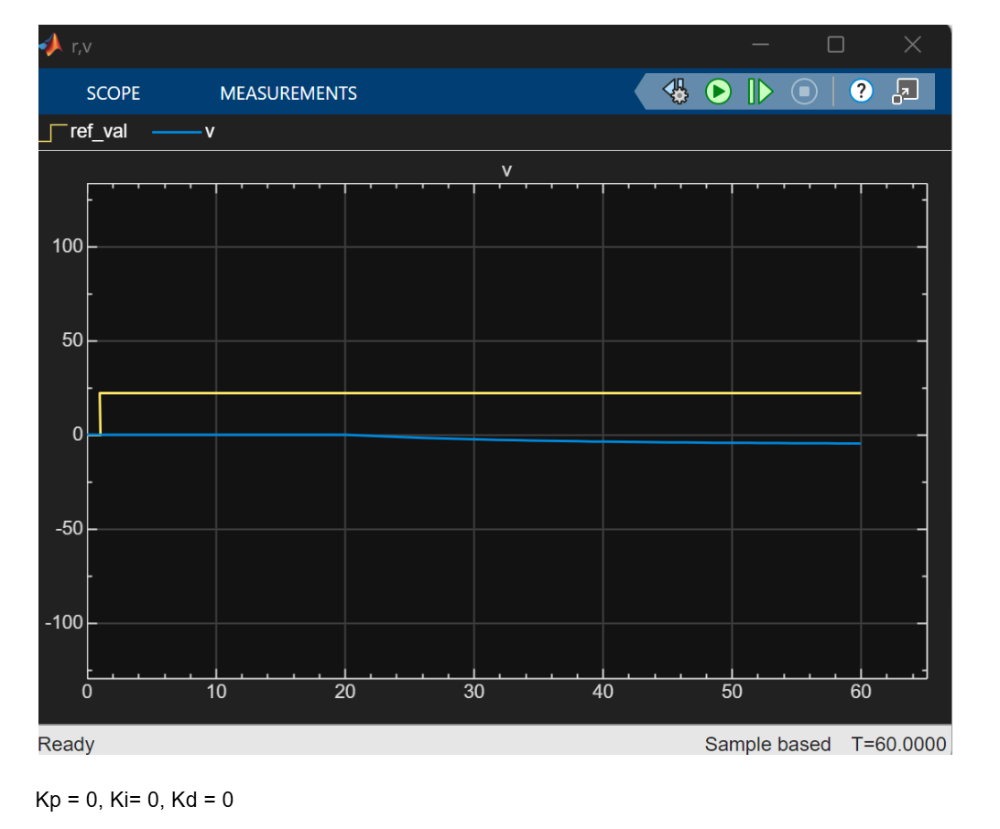
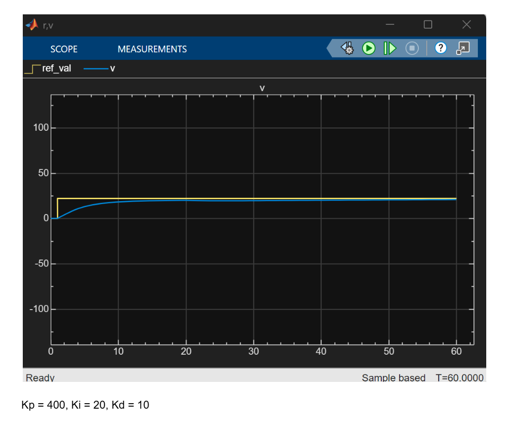
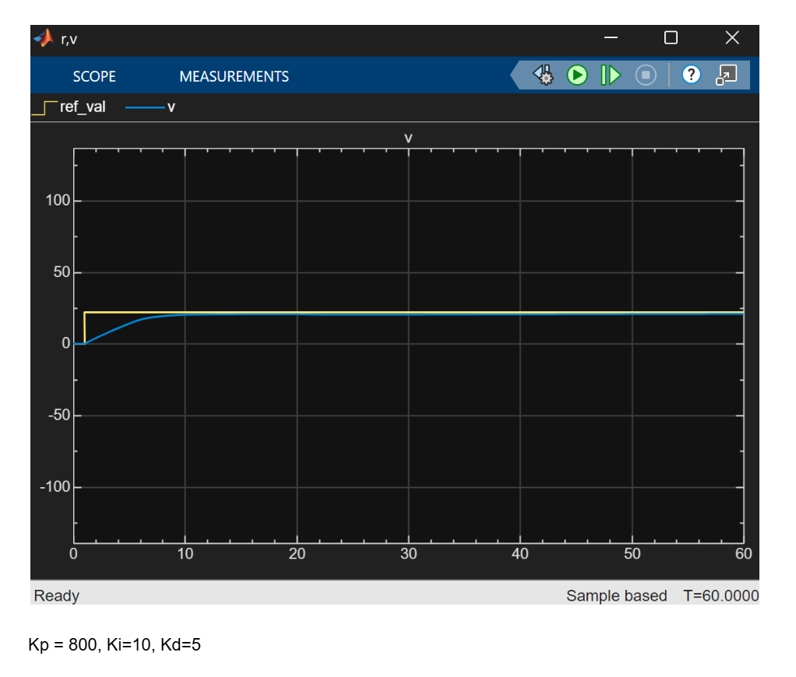

As my passion for control systems and control theory continues to grow, I recently began learning how to use MATLAB and Simulink and the first thing I wanted to do was build something fun. I started just doing problems on cody, making small circuits and fragments of code. 

I now designed a cruise control control system for a car on simulink, using a simple dynamic equation and design a feedback controller that keeps the vehicle traveling at a constant speed, also assuming a disturbance force from going uphill. 

During high school, my favorite areas in physics and math aside from electricity, were mechanics, kinematics, and calculus. Pursuing computer engineering has since streamlined my focus toward electricity, embedded systems, and computing, however this project felt like a nostalgic return to my A-level roots. It was both refreshing and mildly traumatic in the best academic sense.

  

Input: Desired speed (Step block) – in m/s Output: Actual vs Desired vehicle speed (Scope block output) – in m/s

For a car moving in one dimension, Newton's second law gives us:
ma = F_applied - F_drag - F_disturbance
Where:
m = vehicle mass (kg)
a = dv/dt = acceleration (m/s²)
F_applied = throttle force from engine (N)
F_drag = air resistance and rolling resistance (N)
F_disturbance = external forces like hills, wind (N)

Coverting it to an ode:

The Complete Force Balance:
m * dv/dt = u(t) - b * v(t) - d(t)
Where:
u(t) = control input (throttle force)
Physical origin: Force delivered by engine through transmission to wheels
b * v(t) = drag force (proportional to speed)
Physical origin: Combined air resistance, rolling resistance, and drivetrain friction
How we get b = 100:  coefficient representing total drag per unit velocity, we assume it to be 100, referring to an average example where at highway speed (30 m/s), typical car experiences ~3000 N total drag
So b ≈ 3000 / 30 = 100 N·s/m (reasonable approximation)

d(t) = disturbance force
Physical origin: External forces beyond our control
In our model: 500 N step at t = 20s (simulates moderate hill or strong headwind)

Assumed car of mass 1500 

Final ODE:
dv/dt = -0.0666667 * v(t) + 0.000666667 * u(t) - 0.000666667 * d(t)

How It Works
1. Reference Input
Driver sets desired speed: 80 km/h = 22.2222 m/s
System receives this as reference signal r(t)
2. Feedback Measurement
Speed sensor measures actual vehicle velocity v(t)
This creates a closed-loop system
3. Error Calculation
Error: e(t) = r(t) - v(t)
Positive error → car too slow, need more throttle
Negative error → car too fast, reduce throttle
4. PID Controller Processing
Proportional (P) Control:
uP = Kp * e(t)
- Provides an immediate response proportional to the current error.
- A larger error produces a stronger control action.

Integral (I) Control:
uI = Ki * ∫0^t e(τ) dτ
- Eliminates steady-state error.
- Accumulates small errors over time to ensure the system reaches the desired target.
- Essential for precisely achieving the target speed.

Derivative (D) Control:
uD = Kd * de(t)/dt
- Predicts future errors based on the rate of change of the error.
- Helps reduce overshoot and improves system stability.

Controller Objectives:
- Reach and maintain the target speed.
- Handle disturbances with only brief deviations.
- Achieve zero steady-state error when integral control is active.
- If the vehicle does not reach the set point, increase Kp or Ki.
- If the vehicle overshoots or becomes unstable, reduce Kd or Kp.

Here are some experiments I did with random values:
  

  

  

5. Control Signal
Total control: u(t) = uP + uI + uD
Represents desired throttle force

6. Actuator Saturation
Physical throttle has limits: 0 <= u <= 6000 N

7. Vehicle Dynamics
Applied force u(t) affects vehicle
Vehicle responds according to ODE: dv/dt = f(v, u, d)

8. Disturbance Handling
At t = 20s: 500 N disturbance (like climbing a hill)
Controller automatically increases throttle to maintain speed
Integral action ensures no steady-state speed error

Control Theory Principles:
Closed-loop feedback ensures automatic correction

I tried re-modeling the system using a PID block, as well as Transfer Function blocks instead of building it from differential equations, and also tried to define your system in the s-domain and see how it responds. It was very fun and took me a lot of trial and error, but for the final model I resorted to building my own controller, and also making the ode since I haven't done odes in sooo long and this was a very nice and fun refresher and it was nice to see everything layed out.