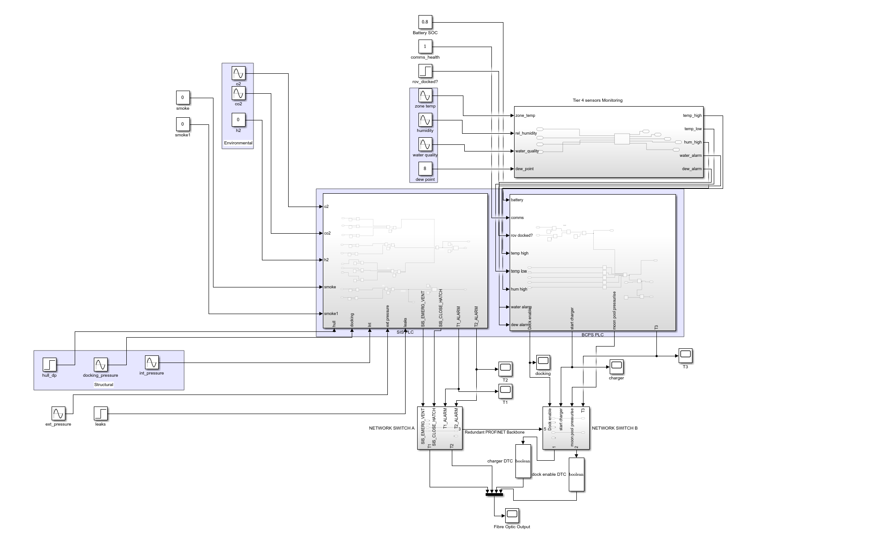
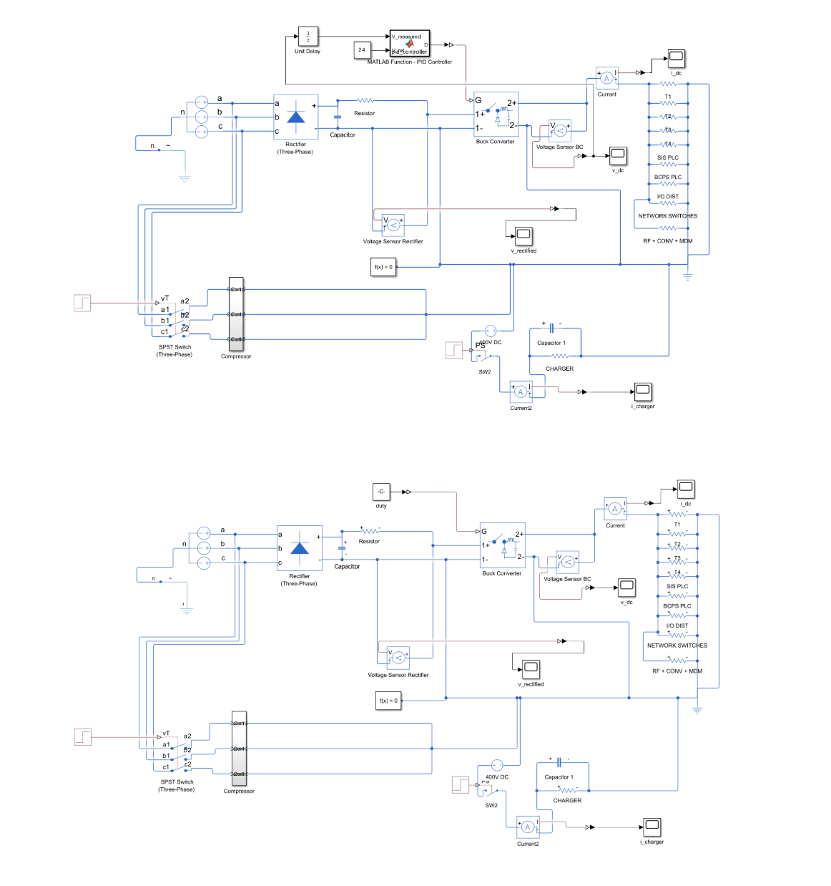

For one of my Year-2 engineering project modules, I was tasked with handling the control, instrumentation, and automation systems for a conceptual autonomous underwater habitat.

The first diagram presents a software-in-the-loop simulation of a complex industrial control architecture, implemented as a Simulink-based digital twin of a dual-PLC Safety Instrumented System (SIS) and Basic Process Control System (BPCS), demonstrating strict IEC 61508 functional segregation and multi-tier sensor voting logic.

Key Features:

* Rather than modelling sensors as simple binary inputs, each of the 74 sensor channels is simulated as a first-order dynamic system using the state-space transfer function $G(s)=\frac{K}{\tau s+1}$, where $K$ is derived from the ISA-5.1 4–20 mA standard and $\tau$ from manufacturer $T_{90}$ response times.
* Physical inputs are modelled using specific, designated sinewave/step/constant blocks to represent realistic environmental fluctuations. Normal operation uses biased Sine Wave sources that oscillate naturally below alarm thresholds, while critical fault conditions are injected using Step blocks to test system response.
* The 74-channel sensor suite is classified into four tiers based on the consequence severity of failure, consistent with IEC 61508-2 ED3 Clause 7.4.4. The simulation mathematically executes the voting truth tables specified in IEC 61508-6 Annex B: **2oo3** for life-critical Tier 1 sensors, **1oo2** for structural Tier 2, **2oo2** for infrastructure Tier 3, and single-channel logic for environmental Tier 4 monitoring.
* The Safety Instrumented System and Basic Process Control System are implemented as completely segregated subsystems.
* All telemetry from the sensor network is routed into a 4-channel multiplexer and transmitted continuously over a simulated fibre-optic link to shore, remaining uninterrupted even during safety events.

The second model simulates the complete electrical power chain, from a three-phase AC source through a six-diode rectifier, down to a 24 V DC instrumentation bus powering the habitat's full sensor and automation infrastructure.

Rather than modelling every sensor at component level, the simulation uses a deliberate abstraction strategy that was required for the assignment: each sensor tier is aggregated into a single equivalent resistive load block in Simscape, with resistance calculated from

$$
R=\frac{V^2}{P_{\mathrm{nom}}}
$$

at the 24 V DC bus. This allows the full 74-channel sensor network to be represented realistically in terms of power consumption without the computational overhead of 74 individual signal chains.

I referenced my load values from real hardware datasheets. PLC power budgets are taken directly from the Siemens S7-1200 System Manual V4.3 Tables A-47 and A-52, docking loads from the Atlas Copco LT5-15 and Blue Logic Subsea-USB product catalogues, and sensor power values are derived uniformly from the ISA-5.1 4–20 mA standard, giving

$$
P_{\max}=24,\mathrm{V}\times20,\mathrm{mA}=480,\mathrm{mW}
$$

per standard channel, with justified exceptions for bridge sensors, FBG interrogators, and discrete sensors.

The highlight of this model is a custom PID controller, written from scratch as a MATLAB Function block, which continuously regulates the Buck converter output voltage by computing incremental duty cycle adjustments rather than absolute values, which was a deliberate design choice that inherently avoids the integral accumulation behaviour encountered with positional PID implementations, eliminating the need for explicit anti-windup clamping.

The final controller achieves approximately ten times better voltage regulation than the open-loop converter with no efficiency penalty, and the iterative process of developing it is one of the most interesting parts of the project, demonstrating how simulation forces you to engage with implementation challenges that pure analytical calculations rarely expose.

One unexpected discovery arose during model validation: the Simscape three-phase voltage source uses internal modelling assumptions that differ from the simplified textbook rectifier equations, meaning the theoretical 284 V source setting did not produce the expected DC output. The correct value was determined through empirical iteration to achieve the required operating point. This proved to be a valuable reminder that successful model-based engineering requires validating theoretical calculations against the behaviour of the simulation itself, highlighting how digital twins can reveal practical implementation differences that traditional hand calculations alone may overlook.
