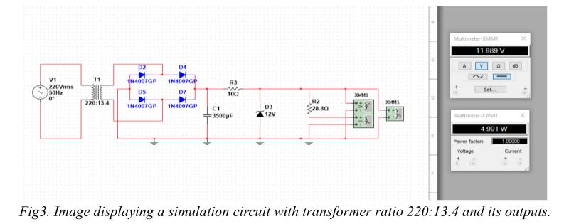

Linear Power Supply : Integrated Design Project B
Designed and simulated a linear AC-to-DC power supply to convert 220V AC input into a stable 12V DC output at 5W. 
Components selected included a step-down transformer, full-wave rectifier using 1N4007 diodes, a smoothing capacitor, a Zener diode for regulated and smoothed output, and resistors for load and current control.
Multiple circuit configurations were tested using NI Multisim to evaluate performance under varying secondary voltages (12V, 13.4V, 15V). The optimal design was chosen based on stability, output accuracy, and minimal ripple, confirmed through waveform analysis.
After validating the design in simulation, we built and soldered the final design onto a protoboard. The completed circuit was tested using lab equipment, and the output closely matched our simulation results.

  