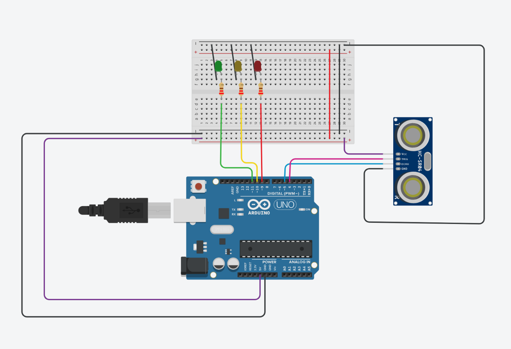

# Distance-Activated Traffic Light System 🚦

I made a smart traffic light system that uses distance instead of a button to change the lights. When something comes within 5cm of the sensor, the system triggers a full traffic light cycle ,simulating how traffic lights behave in real life.
Originally, I wanted to use a pedestrian-style button like normal traffic systems, but I got bored of that idea. Also, the buttons that come with the kit aren’t great and nice to work with so I thought I’d  have fun with the sensor instead.

## Components Used
• Arduino Uno  
• HC-SR04 Ultrasonic Sensor  
• 3 LED lights (Red, Yellow, Green)  
• 3 × 220Ω resistors  
• Jumper wires  
• Breadboard  

## Features
• Proximity Detection: Ultrasonic sensor detects objects within 5cm  
• Automatic Traffic Cycle: Red → Yellow → Green sequence when triggered  
• Real-time Monitoring: Serial output shows distance readings   

## Steps to Build
1.	Find your components: Arduino, sensor, LEDs, resistors, wires, and breadboard.  
2.	Figure out resistor values for your LEDs.  
You can check LED specs from wherever you got them or look up the datasheet.  
Use Ohm’s Law: V = I × R or more precisely:  
R = (V_supply - V_forward) / I_forward  
For nerds like me:  
If you don’t have exact resistor with the values calculated, you can calculate a range using I_min and I_max in the second formula. But honestly, for most LEDs, anything between 220Ω and 1kΩ works fine.  

3.	Build your circuit.  
Here's the basic schematic (I made mine on Tinkercad):  

If you decide to simulate this project on Tinkercad before testing it physically, keep in mind that the ultrasonic sensor might not behave exactly like it does in real life. There’s a limit to how accurately it can detect short distances in the simulation, so instead of checking for objects within 5cm, I set my trigger condition to distance < 40cm since it wasn’t working.  
Also, a good practice when building your circuit: color-code your wires. It makes everything easier to follow, especially when debugging or sharing your schematic.  
Moving on:  

•	Connect VCC of Arduino to red line on breadboard and GND to blue/black line. Mirror those to the other side using jumper wires.  
•	Place LEDs on the board. Connect a resistor to the same line as the anode (long leg), and wire that to an Arduino pin.  
•	Connect the cathode (short leg) to ground.  
•	Hook up the ultrasonic sensor:   
o	Trig and Echo pins → Arduino  
o	VCC and GND → Breadboard power rails  

## How It Works
1.	Continuously monitors distance using the ultrasonic sensor  
2.	When an object is detected within 5cm:   
o	Activates red light (stop signal)  
 
o	Waits 2 seconds with yellow light (warning)  
 
o	Switches to green light for 3 seconds (go signal)  
 
o	Returns to red light (default state)  
 
3.	Repeats the cycle  

## Technical Details
• Language: C++  
• IDE: Arduino IDE  

Using functions like stop(), waitAndGo(),  readDistance()  I find makes your code easier to read and debug. Instead of stuffing everything into loop(), you break things down by what each part does, and just call them in your main loop. That’s the beauty of procedural programming  you organize your code into reusable blocks that do one job well.  

It also means that if you ever want to upgrade this project like adding a buzzer or a pedestrian countdown you  just plug in new functions without messing up the whole flow. I actually experimented with adding a servo motor to the system just for fun. I wrote a separate function to control its movement and reused it whenever needed. It’s not part of a standard traffic light setup, so I didn’t include it in the main post, but it was a good way to test modular code and expand the project.  
